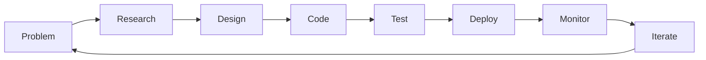

# 🌍 Building the Web, One Component at a Time  

> *"Code is like humor. When you have to explain it, it's bad."* – Cory House  

Hey there 👋, I'm **Samuel Ochieng**, a **Full-Stack Developer** from **Nairobi, Kenya 🇰🇪**.  
I craft scalable, user-focused web applications where **React meets Flask**, and **PostgreSQL stores the magic**.  

---

## 🧠 Developer DNA  

```javascript
const samuel = {
  role: "Full-Stack Developer",
  location: "Nairobi, Kenya",
  currentFocus: "Building scalable web experiences",
  philosophy: "Clean, simple, human-centered code",
  techStack: {
    frontend: ["React.js", "Next.js", "Tailwind CSS"],
    backend: ["Flask", "Node.js/Express"],
    database: ["PostgreSQL + Drizzle ORM"],
  },
  hobbies: ["Exploring Nairobi's tech scene", "System design deep-dives", "Side-project tinkering"]
};
````

---

Core Skills:
React · Next.js · TailwindCSS · Flask · Express.js · PostgreSQL · Drizzle ORM

---

## 📈 GitHub Stats

<div align="center">


</div>

---

## 🚀 Current Projects

* 🏗️ Full-stack SaaS platform (React + Flask)
* 📚 Component library powered by Tailwind CSS
* ⚡ PostgreSQL query optimization + Drizzle ORM exploration

---

## 🌟 Connect With Me

<div align="center">

[](https://portfol-io)
[](https://linkedin-url)
[](mailto:o.samuelyannick@gmail.com)

</div>

---

## 💡 My Approach



---

<div align="center">
<sub>🚀 Built with passion | ⚡ Fueled by coffee | 🌟 Always learning, always building</sub>
</div>
